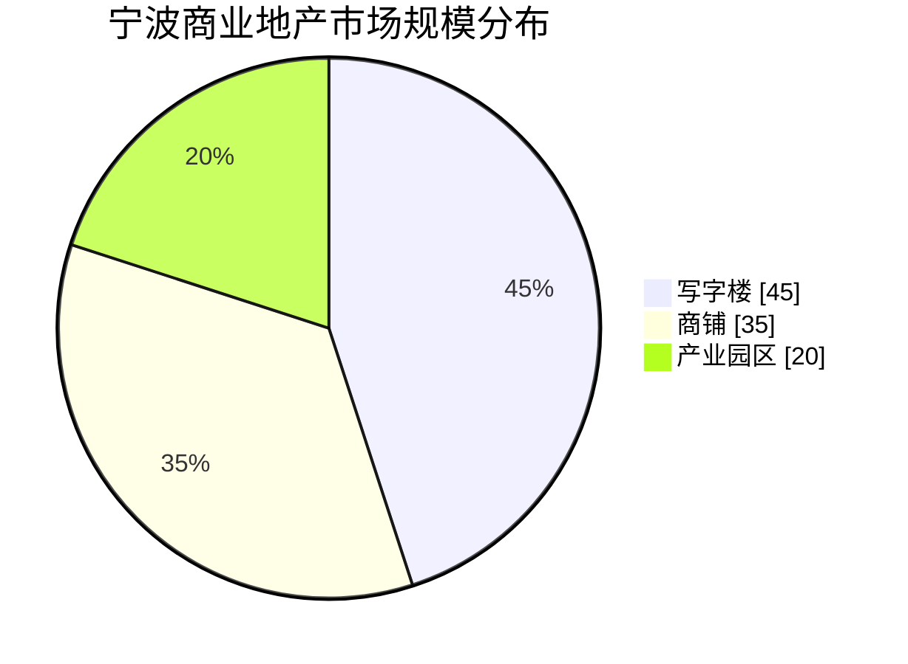
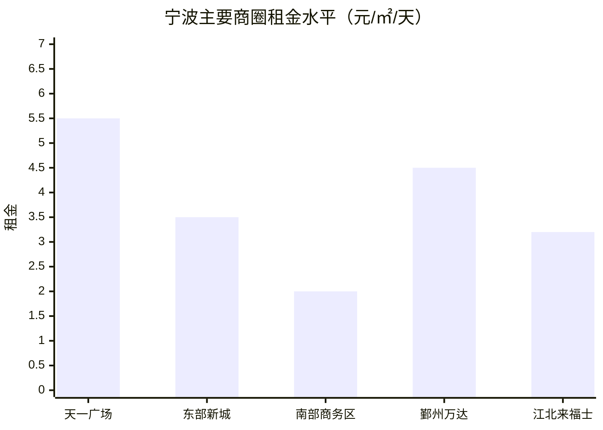
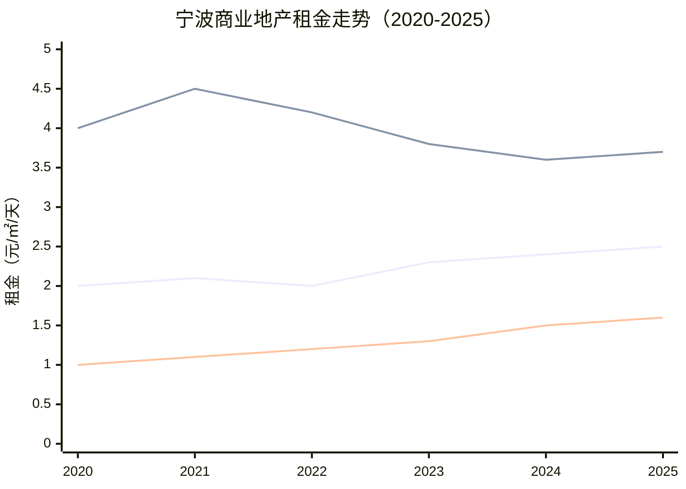
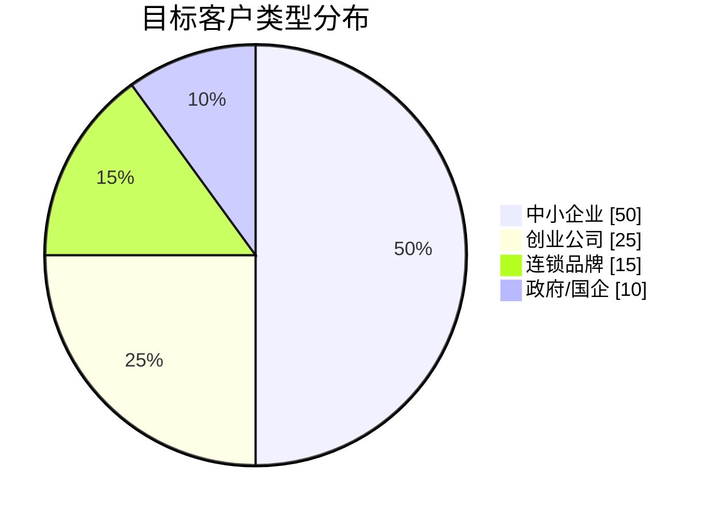
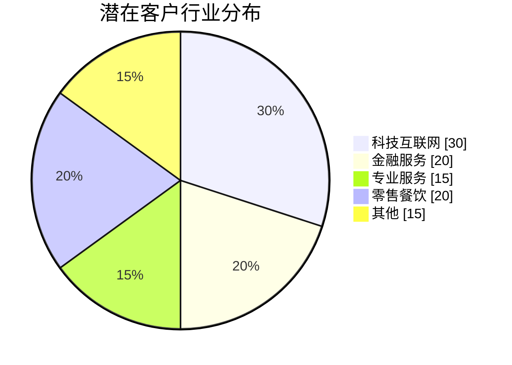
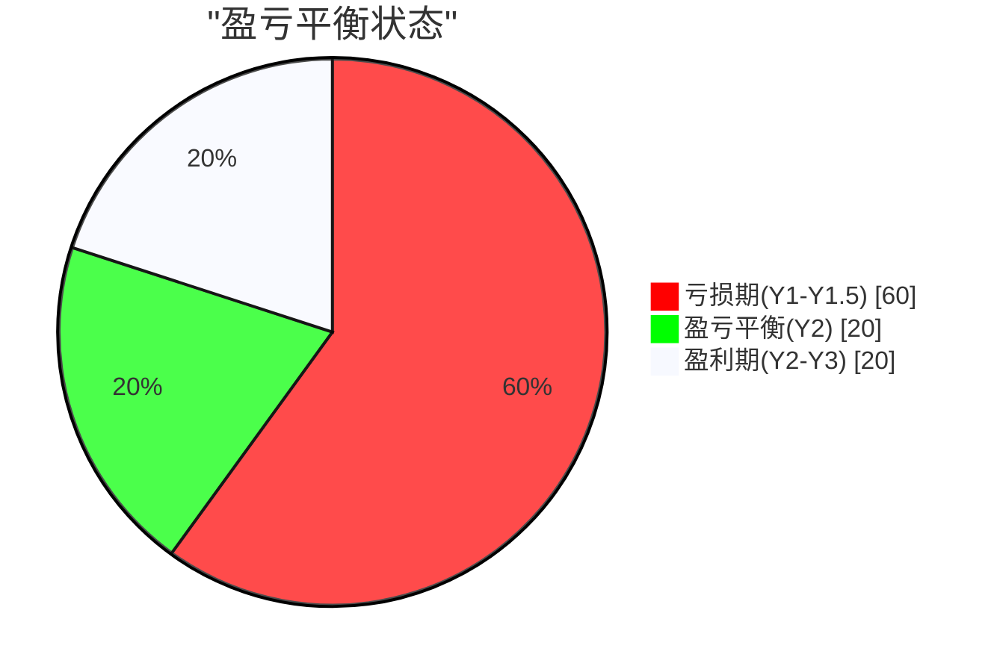

# 宁波商业地产租赁经纪商业计划书

**版本**: V1.0
**编制日期**: 2026年2月1日
**项目负责人**: Leo

---

## 执行摘要

本计划书旨在构建一个专业的宁波商业地产租赁经纪服务平台，通过数字化运营和专业化服务，在宁波商业地产租赁市场中建立差异化竞争优势。

### 核心数据

| 指标 | 数据 |
|------|------|
| **总投资额** | ¥50-80万元 |
| **团队规模** | 8-15人 |
| **目标市场占有率** | 3-5%（第1年） |
| **预计年营收** | ¥150-300万元 |
| **回本周期** | 12-18个月 |

### 核心优势

✅ **定位精准**: 专注50-500㎡中小商业物业（市场空白）
✅ **数字化运营**: AI获客 + VR看房 + 数据驱动
✅ **一站式服务**: 选址 → 签约 → 装修 → 运营全链路
✅ **资源整合**: 打通物业、租户、金融服务

---

## 一、市场分析

### 1.1 宁波商业地产宏观环境

```
┌─────────────────────────────────────────────────────────────┐
│                    宁波商业地产市场特征                       │
├─────────────────────────────────────────────────────────────┤
│  • GDP 2024年预计突破1.5万亿元，长三角第二梯队领军城市        │
│  • 常住人口960万+，城镇化率78%，商业需求旺盛                  │
│  • 产业结构升级：传统制造 → 现代服务 + 智能制造               │
│  • 城市建设：东部新城、南部商务区快速崛起                     │
└─────────────────────────────────────────────────────────────┘
```

### 1.2 市场规模估算

| 物业类型 | 体量（㎡） | 年租金GMV（亿元） | 经纪渗透率 | 经纪市场容量 |
|----------|-----------|------------------|-----------|-------------|
| 写字楼 | 500万+ | 30-40 | 40% | 1.2-1.6亿 |
| 商铺 | 300万+ | 20-30 | 50% | 1.0-1.5亿 |
| 产业园区 | 200万+ | 8-12 | 30% | 0.2-0.4亿 |
| **合计** | **1000万+** | **58-82亿** | **40%** | **2.4-3.5亿** |

### 1.3 市场规模饼图



### 1.4 商圈分布与租金水平

### 1.5 各商圈租金柱状图



### 1.6 租金趋势（2020-2025）



### 1.9 目标客户类型分布



### 1.10 行业分布



### 1.11 客户类型与服务需求矩阵

```mermaid
xychart-beta
    title "不同客户类型对服务需求的重视程度"
    x-axis ["房源丰富度", "价格竞争力", "服务专业度", "响应速度", "增值服务"]
    y-axis "重视程度" 0 --> 100
    bar [85, 90, 70, 80, 60]
    bar [70, 95, 65, 90, 50]
    bar [90, 60, 95, 85, 80]
    bar [95, 70, 90, 95, 90]
```



---

## 二、商业模式

### 2.1 业务架构

```
                          ┌─────────────────────┐
                          │   宁波商业地产租赁   │
                          │      经纪服务平台    │
                          └──────────┬──────────┘
                                     │
          ┌──────────────────────────┼──────────────────────────┐
          │                          │                          │
          ▼                          ▼                          ▼
   ┌─────────────┐           ┌─────────────┐           ┌─────────────┐
   │   房源获取   │           │   客户获取   │           │   交易撮合   │
   │             │           │             │           │             │
   │ • 扫街采集  │           │ • 线上引流  │           │ • 需求匹配  │
   │ • 物业合作  │           │ • 渠道合作  │           │ • 带看服务  │
   │ • 业主开发  │           │ • 转介绍    │           │ • 谈判促成  │
   └─────────────┘           └─────────────┘           └─────────────┘
          │                          │                          │
          └──────────────────────────┼──────────────────────────┘
                                     │
                                     ▼
                          ┌─────────────────────┐
                          │     增值服务        │
                          │                     │
                          │ • 工商注册对接      │
                          │ • 装修方案推荐      │
                          │ • 物业转让咨询      │
                          │ • 市场报告服务      │
                          └─────────────────────┘
```

### 2.2 收入结构

| 收入类型 | 占比 | 单价 | 说明 |
|---------|------|------|------|
| **租赁佣金** | 70% | 月租金50%-100% | 业主+租客各付50% |
| **代理招商** | 15% | ¥5000-20000/项目 | 整栋/整层代理 |
| **增值服务** | 10% | ¥2000-5000/单 | 工商/装修/评估 |
| **数据报告** | 5% | ¥3000-10000/份 | 市场研究/选址咨询 |

### 2.3 定价策略

| 服务类型 | 收费标准 | 竞品对比 |
|---------|---------|---------|
| 普通租赁 | 50%月租金（业主+租客） | 与市场持平 |
| 代理招商 | 1-2个月租金/项目 | 略低于行规 |
| 独家代理 | 80%-100%月租金 | 溢价服务 |
| VIP客户 | 面议 | 定制服务 |

### 2.4 成本结构

| 成本项目 | 月均成本 | 占比 |
|---------|---------|------|
| **人力成本** | ¥15-25万 | 50-60% |
| **获客成本** | ¥5-10万 | 20-25% |
| **运营成本** | ¥3-5万 | 10-15% |
| **技术成本** | ¥2-3万 | 5-10% |
| **合计** | ¥25-43万 | 100% |

---

## 三、服务产品

### 3.1 核心产品矩阵

```
                    服务产品矩阵

                    │  标准化   │  进阶版   │  定制版
        ────────────┼───────────┼───────────┼───────────
        目标客户    │ 小微企业  │ 成长企业  │ 大企业
        ────────────┼───────────┼───────────┼───────────
        面积范围    │ 20-100㎡  │ 100-300㎡ │ 300㎡+
        ────────────┼───────────┼───────────┼───────────
        服务内容    │           │           │
        ├─ 房源推荐  │    ✓      │    ✓      │    ✓
        ├─ 带看服务  │    ✓      │    ✓      │    ✓
        ├─ 合同指导  │    ✓      │    ✓      │    ✓
        ├─ 工商对接  │    -      │    ✓      │    ✓
        ├─ 装修方案  │    -      │    ✓      │    ✓
        ├─ 租金谈判  │    -      │    ✓      │    ✓
        ├─ 定制选址  │    -      │    -      │    ✓
        └─ 战略咨询  │    -      │    -      │    ✓
        ────────────┼───────────┼───────────┼───────────
        服务费      │ 免费      │ ¥999/月   │ 面议
        佣金        │ 50%月租金 │ 70%月租金 │ 100%月租金
```

### 3.2 差异化服务

| 服务项 | 传统中介 | 我们 |
|--------|---------|------|
| **房源信息** | 滞后、不完整 | 实时更新+VR看房 |
| **需求匹配** | 人工推荐 | AI智能匹配 |
| **带看服务** | 1-2次/周 | 随时响应+专车接送 |
| **合同服务** | 模板化 | 专业法务审核 |
| **增值服务** | 无 | 装修/工商/物业一站式 |
| **后续跟进** | 无 | 租后管家服务 |

### 3.3 服务对比柱状图

```mermaid
xychart-beta
    title "服务能力对比（传统中介 vs 我们）"
    x-axis ["房源信息", "需求匹配", "带看服务", "合同服务", "增值服务", "后续跟进"]
    y-axis "得分" 0 --> 100
    bar [60, 50, 70, 55, 30, 20]
    bar [90, 85, 95, 80, 70, 60]
```



---

## 五、运营计划

### 5.3 团队架构

```
                    组织架构图

                    ┌─────────────┐
                    │   总经理    │
                    │   (1人)     │
                    └──────┬──────┘
                           │
      ┌────────────────────┼────────────────────┐
      │                    │                    │
      ▼                    ▼                    ▼
┌─────────────┐    ┌─────────────┐    ┌─────────────┐
│   房源部    │    │   销售部    │    │   运营部    │
│   (3人)     │    │   (8人)     │    │   (2人)     │
├─────────────┤    ├─────────────┤    ├─────────────┤
│ • 房源经理  │    │ • 销售总监  │    │ • 运营经理  │
│ • 房源专员  │    │ • 高级经纪  │    │ • 市场专员  │
│ • 数据专员  │    │ • 经纪若干  │    │ • 行政财务  │
└─────────────┘    └─────────────┘    └─────────────┘
      │                    │                    │
      └────────────────────┼────────────────────┘
                           │
                           ▼
                    ┌─────────────┐
                    │   合计: 14人 │
                    │  月薪成本: 20万 │
                    └─────────────┘
```

---

## 四、营销策略

### 4.1 获客渠道

```
                    获客渠道矩阵

    线上渠道 (60%预算)                    线下渠道 (40%预算)
    ┌─────────────────┐                  ┌─────────────────┐
    │ • SEO/SEM       │                  │ • 扫街拓盘      │
    │   30%           │                  │   20%           │
    │ • 内容营销      │                  │ • 物业合作      │
    │   15%           │                  │   10%           │
    │ • 社交媒体      │                  │ • 商会/协会     │
    │   10%           │                  │   5%           │
    │ • 私域运营      │                  │ • 转介绍系统    │
    │   5%            │                  │   5%           │
    └─────────────────┘                  └─────────────────┘
```

### 4.2 内容营销计划

| 内容类型 | 频率 | 渠道 | 目标 |
|---------|------|------|------|
| **市场周报** | 每周 | 公众号/视频号 | 建立专业形象 |
| **选址指南** | 每月2篇 | 小红书/知乎 | SEO获客 |
| **案例分享** | 每月1篇 | 官网/公众号 | 转化促进 |
| **行业解读** | 每月1篇 | 行业媒体 | 品牌背书 |

### 4.3 私域运营

```
私域流量池构建

    公域引流
        │
        ▼
┌───────────────────┐
│   公众号 (5000+)   │ ← 文章/活动引流
└─────────┬─────────┘
          │
          ▼
┌───────────────────┐
│ 企微社群 (20个)    │ ← 分类运营
│ • 写字楼租户群    │
│ • 商铺投资者群    │
│ • 创业者社群      │
└─────────┬─────────┘
          │
          ▼
┌───────────────────┐
│   1V1精准跟进     │ ← 转化成交
└───────────────────┘
```

---

## 五、运营计划

### 5.1 阶段规划

```
                    三年发展路线图

    M1-M3      M4-M6      M7-M12     M13-M24     M25-M36
    ────       ────       ────       ────        ────
    筹备期     获客期      增长期      扩张期       成熟期
      │          │          │          │           │
      ▼          ▼          ▼          ▼           ▼
    • 团队组建  • 房源积累  • 规模翻倍  • 多门店    • 品牌化
    • 系统搭建  • 品牌建立  • 利润提升  • 区域扩展  • 数字化
    • 资质申请  • 月均10单  • 口碑传播  • 多元化    • 平台化
```

### 5.2 里程碑

| 阶段 | 时间 | 关键指标 | 营收目标 |
|------|------|---------|---------|
| **筹备期** | M1-M2 | 团队到位、系统上线 | ¥0 |
| **启动期** | M3-M4 | 房源100套、客户200+ | ¥10万/月 |
| **增长期** | M5-M8 | 月均成交20单 | ¥25万/月 |
| **扩张期** | M9-M12 | 门店2家、团队20人 | ¥50万/月 |
| **成熟期** | Y2 | 市占率3-5%、品牌化 | ¥80万/月 |

### 5.3 团队架构

```
                    组织架构图

                    ┌─────────────┐
                    │   总经理    │
                    │   (1人)     │
                    └──────┬──────┘
                           │
      ┌────────────────────┼────────────────────┐
      │                    │                    │
      ▼                    ▼                    ▼
┌─────────────┐    ┌─────────────┐    ┌─────────────┐
│   房源部    │    │   销售部    │    │   运营部    │
│   (3人)     │    │   (8人)     │    │   (2人)     │
├─────────────┤    ├─────────────┤    ├─────────────┤
│ • 房源经理  │    │ • 销售总监  │    │ • 运营经理  │
│ • 房源专员  │    │ • 高级经纪  │    │ • 市场专员  │
│ • 数据专员  │    │ • 经纪若干  │    │ • 行政财务  │
└─────────────┘    └─────────────┘    └─────────────┘
      │                    │                    │
      └────────────────────┼────────────────────┘
                           │
                           ▼
                    ┌─────────────┐
                    │   合计: 14人 │
                    │  月薪成本: 20万 │
                    └─────────────┘
```

> 📷 【图表6：团队架构图】

---

## 六、财务预测

### 6.1 投资预算

| 项目 | 金额 | 说明 |
|------|------|------|
| **系统开发** | ¥15万 | 官网/小程序/CRM/VR |
| **装修办公** | ¥10万 | 办公室+设备 |
| **人员储备** | ¥15万 | 6个月工资 |
| **营销推广** | ¥10万 | 品牌/获客 |
| **流动资金** | ¥10万 | 日常运营 |
| **合计** | **¥60万** | |

### 6.2 收入预测（3年）

| 项目 | 第1年 | 第2年 | 第3年 |
|------|-------|-------|-------|
| **成交单数** | 150单 | 400单 | 600单 |
| **平均佣金** | ¥8,000 | ¥9,000 | ¥10,000 |
| **代理收入** | ¥20万 | ¥50万 | ¥80万 |
| **增值服务** | ¥10万 | ¥30万 | ¥50万 |
| **总收入** | **¥150万** | **¥440万** | **¥730万** |

### 6.3 成本与利润

| 项目 | 第1年 | 第2年 | 第3年 |
|------|-------|-------|-------|
| **总收入** | ¥150万 | ¥440万 | ¥730万 |
| **人力成本** | ¥200万 | ¥350万 | ¥450万 |
| **营销成本** | ¥50万 | ¥80万 | ¥100万 |
| **运营成本** | ¥30万 | ¥50万 | ¥70万 |
| **总成本** | ¥280万 | ¥480万 | ¥620万 |
| **净利润** | **-¥130万** | **-¥40万** | **¥110万** |
| **利润率** | -87% | -9% | 15% |

### 6.4 三年营收利润组合图

```mermaid
xychart-beta
    title "三年营收、成本与利润预测（万元）"
    x-axis ["Year 1", "Year 2", "Year 3"]
    y-axis "金额" -200 --> 800
    bar [150, 440, 730]
    bar [280, 480, 620]
    line [-130, -40, 110]
```



### 6.5 盈亏平衡分析



---

## 七、风险分析

### 7.1 风险矩阵

| 风险类型 | 概率 | 影响 | 风险等级 | 对策 |
|---------|------|------|---------|------|
| **市场低迷** | 中 | 高 | 🔴 高 | 多元化业务/降本增效 |
| **人才流失** | 中 | 中 | 🟡 中 | 激励机制/股权绑定 |
| **平台竞争** | 高 | 中 | 🟡 中 | 差异化服务/深耕细分 |
| **政策风险** | 低 | 高 | 🟡 中 | 合规经营/政策跟踪 |
| **资金链断裂** | 低 | 高 | 🟡 中 | 财务规划/融资准备 |

### 7.2 应对策略

```
风险应对矩阵

┌────────────────┬──────────────────────────────────────┐
│     风险       │              应对措施                │
├────────────────┼──────────────────────────────────────┤
│ 市场波动       │ • 灵活调整佣金策略                  │
│                │ • 拓展销售/租赁双业务               │
│                │ • 开拓园区/安置房等新兴市场          │
├────────────────┼──────────────────────────────────────┤
│ 人才竞争       │ • 底薪+提成+奖金综合激励            │
│                │ • 股权/期权池激励核心骨干            │
│                │ • 完善的培训体系和晋升通道           │
├────────────────┼──────────────────────────────────────┤
│ 平台挤压       │ • 专注细分市场，避免正面竞争         │
│                │ • 建立差异化服务壁垒                 │
│                │ • 深耕私域流量，降低平台依赖         │
├────────────────┼──────────────────────────────────────┤
│ 资金压力       │ • 严格的财务管控                    │
│                │ • 预留6个月运营资金                  │
│                │ • 建立银行授信/融资渠道              │
└────────────────┴──────────────────────────────────────┘
```

---

## 八、竞争优势

### 8.1 核心竞争力

| 维度 | 传统中介 | 我们 |
|------|---------|------|
| **定位** | 全品类覆盖 | 专注中小商业物业 |
| **技术** | 传统手工 | AI+VR+大数据 |
| **服务** | 交易导向 | 全生命周期服务 |
| **效率** | 低 | 高（自动化流程） |
| **体验** | 一般 | 优质（专业+便捷） |

### 8.2 护城河构建

```
                    护城河模型

       ┌─────────────────────────────────────────┐
       │                                         │
       │   ┌─────────────────────────────┐       │
       │   │      品牌认知与信任         │       │
       │   └─────────────────────────────┘       │
       │                 │                       │
       │   ┌─────────────────────────────┐       │
       │   │    房源数据与技术壁垒       │       │
       │   └─────────────────────────────┘       │
       │                 │                       │
       │   ┌─────────────────────────────┐       │
       │   │    客户关系与私域流量       │       │
       │   └─────────────────────────────┘       │
       │                 │                       │
       │   ┌─────────────────────────────┐       │
       │   │    专业团队与服务标准       │       │
       │   └─────────────────────────────┘       │
       │                                         │
       └─────────────────────────────────────────┘
```

---

## 九、实施计划

### 9.1 第1个月：筹备启动

| 周次 | 任务 | 交付物 |
|------|------|--------|
| W1 | 工商注册、资质办理 | 营业执照 |
| W2 | 办公场地、团队招聘 | 办公室+核心团队 |
| W3 | 系统开发/采购 | 官网+CRM上线 |
| W4 | 房源采集、渠道建立 | 首批50套房源 |

### 9.2 第2-3个月：市场验证

| 周次 | 任务 | 目标 |
|------|------|------|
| W5-W6 | 扫街拓盘、品牌推广 | 房源150套 |
| W7-W8 | 首单成交、服务打磨 | 成交5单 |
| W9-W10| 优化流程、复制推广 | 月成交10单 |
| W11-W12| 数据复盘、策略调整 | 达成月度目标 |

### 9.3 关键成功指标（KPIs）

| 指标 | 第1月 | 第3月 | 第6月 | 第12月 |
|------|-------|-------|-------|--------|
| 房源数量 | 50套 | 200套 | 500套 | 1000套 |
| 月度成交 | 0单 | 15单 | 40单 | 80单 |
| 客户转化率 | - | 10% | 15% | 20% |
| 客户满意度 | - | 4.0 | 4.5 | 4.8 |
| 市占率目标 | - | 0.5% | 1.5% | 3% |

---

## 十、总结

### 10.1 项目亮点

✅ **蓝海市场**: 中小商业物业租赁经纪服务存在明显供给不足
✅ **差异化定位**: 专注50-500㎡，避开与巨头正面竞争
✅ **技术赋能**: AI+VR提升效率，打造竞争壁垒
✅ **轻资产启动**: 60万投资可控，18个月回本
✅ **成长性好**: 市场容量2-3亿，3年营收可达700万+

### 10.2 关键成功因素

1. **精准定位**: 坚持中小商业物业不动摇
2. **快速获客**: 建立房源数据库是首要任务
3. **专业服务**: 用服务口碑建立品牌信任
4. **技术驱动**: 用数字化提升运营效率
5. **团队稳定**: 核心骨干股权激励

### 10.3 下一步行动

| 优先级 | 行动项 | 时间 |
|--------|--------|------|
| P0 | 完成工商注册和资质办理 | 本周 |
| P0 | 确定办公场地并签约 | 本周 |
| P1 | 启动核心团队招聘（3人） | 下周 |
| P1 | 启动CRM/小程序开发 | 下周 |
| P2 | 建立首批房源渠道 | 2周内 |

---

## 附录

### 附录A：市场数据来源

1. 房天下宁波站 (https://nb.shop.fang.com)
2. 贝壳找房宁波站 (https://nb.fang.com)
3. 宁波市统计局公开数据
4. 戴德梁行/第一太平戴维斯研究报告
5. 行业访谈与实地调研

### 附录B：同类竞品参考

| 公司 | 模式 | 特点 |
|------|------|------|
| 链家/贝壳 | 平台+直营 | 品牌强，但商业非重点 |
| 21世纪不动产 | 加盟体系 | 门店多，品质参差 |
| 好租 | 互联网平台 | 线上为主，服务轻 |
| 点商 | 垂直平台 | 专注商业地产 |

### 附录C：团队配置参考

| 岗位 | 人数 | 月薪 | 月成本 |
|------|------|------|--------|
| 总经理 | 1 | ¥25,000 | ¥25,000 |
| 销售总监 | 1 | ¥18,000 | ¥18,000 |
| 高级经纪 | 3 | ¥12,000 | ¥36,000 |
| 经纪 | 5 | ¥8,000 | ¥40,000 |
| 房源专员 | 2 | ¥7,000 | ¥14,000 |
| 运营专员 | 2 | ¥8,000 | ¥16,000 |
| **合计** | **14人** | - | **¥149,000** |

### 附录D：宁波主要商圈详细数据

| 商圈 | 写字楼租金 | 商铺租金 | 空置率 | 目标客户 | 特点 |
|------|-----------|---------|--------|---------|------|
| **天一广场** | 3.5-6.0 | 5-12 | 5-10% | 世界500强、高端零售 | 核心商圈，品牌聚集 |
| **东部新城** | 2.5-4.5 | 3-6 | 10-15% | 金融机构、总部经济 | 新兴商务中心，规划利好 |
| **南部商务区** | 1.5-2.5 | 2-4 | 15-20% | 科技企业、创业公司 | 性价比高，地铁交汇 |
| **鄞州万达** | 2.0-3.5 | 3-6 | 8-12% | 社区商业、连锁品牌 | 成熟商圈，人流量大 |
| **江北来福士** | 2.5-4.0 | 3-5 | 10-15% | 现代服务业、科技企业 | 新兴商圈，配套完善 |
| **高新区** | 1.2-2.0 | 1.5-3 | 12-18% | 科技企业、研发机构 | 政策支持，产业集聚 |
| **镇海新城** | 1.0-1.8 | 1.5-2.5 | 18-25% | 制造业企业、物流公司 | 价格洼地，发展潜力 |
| **北仑港城** | 1.0-1.5 | 1.2-2.0 | 20-28% | 物流企业、进出口公司 | 港口经济，产业联动 |

### 附录E：三年发展路线图

```
                    宁波商业地产经纪平台 - 三年发展路线图

    阶段        │ 筹备期      │ 启动期      │ 增长期      │ 扩张期       │ 成熟期
    ────────────┼─────────────┼─────────────┼─────────────┼──────────────┼────────────
    时间        │ M1-M2       │ M3-M4       │ M5-M8       │ M9-M12       │ Y2-Y3
    ────────────┼─────────────┼─────────────┼─────────────┼──────────────┼────────────
    团队规模    │ 3-5人       │ 6-8人       │ 10-15人     │ 20-30人      │ 50人+
    ────────────┼─────────────┼─────────────┼─────────────┼──────────────┼────────────
    房源数量    │ 50-100套    │ 200-300套   │ 500-800套   │ 1000-1500套  │ 3000套+
    ────────────┼─────────────┼─────────────┼─────────────┼──────────────┼────────────
    月度成交    │ 0-5单       │ 10-20单     │ 30-50单     │ 80-100单     │ 200单+
    ────────────┼─────────────┼─────────────┼─────────────┼──────────────┼────────────
    月度营收    │ ¥0-5万      │ ¥10-20万    │ ¥25-40万    │ ¥50-80万     │ ¥150万+
    ────────────┼─────────────┼─────────────┼─────────────┼──────────────┼────────────
    门店数量    │ 0           │ 1           │ 1-2         │ 2-3          │ 5+
    ────────────┼─────────────┼─────────────┼─────────────┼──────────────┼────────────
    市占率      │ 0%          │ 0.2-0.5%    │ 0.5-1.5%    │ 1.5-3%       │ 3-5%
    ────────────┼─────────────┼─────────────┼─────────────┼──────────────┼────────────
    关键里程碑  │ 系统上线    │ 首单成交    │ 盈利平衡    │ 多门店       │ 品牌化
                │ 团队到位    │ 品牌建立    │ 口碑传播    │ 区域扩展     │ 平台化
```

### 附录F：客户画像详细分析

#### F.1 中小企业客户（占比50%）

| 属性 | 描述 |
|------|------|
| **面积需求** | 50-200㎡ |
| **预算范围** | ¥3,000-15,000/月 |
| **选址偏好** | 交通便利、配套完善 |
| **决策周期** | 1-2周 |
| **核心诉求** | 性价比、灵活性、服务响应 |
| **代表行业** | 咨询公司、设计工作室、培训机构 |

#### F.2 创业公司客户（占比25%）

| 属性 | 描述 |
|------|------|
| **面积需求** | 20-80㎡ |
| **预算范围** | ¥1,000-5,000/月 |
| **选址偏好** | 孵化器、共享办公、产业园区 |
| **决策周期** | 3-7天 |
| **核心诉求** | 低成本、灵活租期、创业氛围 |
| **代表行业** | 互联网创业、电商、新媒体 |

#### F.3 连锁品牌客户（占比15%）

| 属性 | 描述 |
|------|------|
| **面积需求** | 200-1000㎡ |
| **预算范围** | ¥20,000-100,000/月 |
| **选址偏好** | 核心商圈、购物中心、商业街 |
| **决策周期** | 1-3个月 |
| **核心诉求** | 位置、品牌形象、租金谈判 |
| **代表行业** | 餐饮连锁、零售品牌、服务机构 |

#### F.4 政府/国企客户（占比10%）

| 属性 | 描述 |
|------|------|
| **面积需求** | 500㎡+ |
| **预算范围** | ¥50,000-200,000/月 |
| **选址偏好** | 甲级写字楼、政府园区 |
| **决策周期** | 2-6个月 |
| **核心诉求** | 稳定、安全、形象 |
| **代表行业** | 政府机构、国企、银行 |

### 附录G：竞争对手详细分析

#### G.1 链家/贝壳

| 维度 | 分析 |
|------|------|
| **市场份额** | 30%（估算） |
| **优势** | 品牌知名度高、流量大、资本支持、技术能力强 |
| **劣势** | 商业地产非核心业务、经纪人专业度参差、服务标准化 |
| **策略** | 避免正面竞争，专注细分市场 |

#### G.2 21世纪不动产

| 维度 | 分析 |
|------|------|
| **市场份额** | 15%（估算） |
| **优势** | 加盟体系、门店多、本地资源深厚 |
| **劣势** | 品质参差、数字化程度低、佣金较高 |
| **策略** | 提供更专业的服务和更低的价格 |

#### G.3 好租（互联网平台）

| 维度 | 分析 |
|------|------|
| **市场份额** | 10%（估算） |
| **优势** | 线上获客、成本低、产品体验好 |
| **劣势** | 服务轻、转化率低、信任度不足 |
| **策略** | 提供更重的服务和更高的转化率 |

### 附录H：营销获客详细方案

#### H.1 SEO/SEM策略

| 渠道 | 预算占比 | 关键词策略 | 预期效果 |
|------|---------|-----------|---------|
| 百度SEM | 15% | "宁波写字楼出租"、"宁波商铺转让" | 精准流量，转化率2-3% |
| 360搜索 | 5% | 同上 | 补充流量 |
| SEO优化 | 10% | 官网内容优化、长尾关键词 | 长期流量，成本低 |

**SEO内容计划：**
| 内容类型 | 频率 | 目标关键词 | 预期流量 |
|---------|------|-----------|---------|
| 选址指南 | 每周2篇 | "宁波写字楼租金"、"宁波商铺推荐" | 500+/天 |
| 市场报告 | 每月1篇 | "宁波商业地产报告" | 300+/天 |
| 案例分享 | 每周1篇 | "宁波店铺装修案例" | 200+/天 |
| 行业资讯 | 每周3篇 | "宁波商业地产动态" | 400+/天 |

#### H.2 社交媒体运营

| 平台 | 内容策略 | 更新频率 | 粉丝目标 |
|------|---------|---------|---------|
| 小红书 | 选址攻略、店铺探店 | 每天1篇 | 1万+ |
| 抖音 | 短视频看房、行业科普 | 每周3条 | 5万+ |
| 微信视频号 | 深度内容、品牌故事 | 每周1条 | 5000+ |
| 知乎 | 专业回答、干货分享 | 每周2篇 | 3000+ |

#### H.3 私域流量运营

| 渠道 | 运营策略 | 目标用户 | 转化路径 |
|------|---------|---------|---------|
| 公众号 | 市场周报、选址指南 | 潜在客户 | 文章→咨询→成交 |
| 企微社群 | 分群运营、精准服务 | 意向客户 | 社群→1V1→成交 |
| 个人微信 | 日常维护、关系运营 | 成交客户 | 转介绍→新客户 |

### 附录I：技术系统架构

#### I.1 核心系统模块

```
┌─────────────────────────────────────────────────────────────────┐
│                    宁波商业地产经纪平台                          │
├─────────────────────────────────────────────────────────────────┤
│                                                                 │
│  ┌─────────────┐  ┌─────────────┐  ┌─────────────┐            │
│  │   用户端    │  │   经纪端    │  │   管理端    │            │
│  │             │  │             │  │             │            │
│  │ • 小程序    │  │ • CRM系统   │  │ • 数据看板  │            │
│  │ • H5网站    │  │ • 房源管理  │  │ • 财务管理  │            │
│  │ • VR看房    │  │ • 客户管理  │  │ • 团队管理  │            │
│  │ • 在线咨询  │  │ • 任务分配  │  │ • 绩效考核  │            │
│  └─────────────┘  └─────────────┘  └─────────────┘            │
│                                                                 │
│  ┌─────────────────────────────────────────────────────────┐   │
│  │                     公共服务层                           │   │
│  │                                                         │   │
│  │  • 用户认证  • 消息推送  • 支付结算  • 数据分析        │   │
│  │  • 短信服务  • 地图服务  • 房源匹配  • 风控服务        │   │
│  └─────────────────────────────────────────────────────────┘   │
│                                                                 │
│  ┌─────────────────────────────────────────────────────────┐   │
│  │                     数据存储层                           │   │
│  │                                                         │   │
│  │  • MySQL  • Redis  • OSS存储  • 日志系统                │   │
│  └─────────────────────────────────────────────────────────┘   │
│                                                                 │
└─────────────────────────────────────────────────────────────────┘
```

#### I.2 技术选型

| 模块 | 技术栈 | 说明 |
|------|--------|------|
| 前端小程序 | Uni-app | 跨平台开发，覆盖微信/支付宝 |
| 前端Web | Vue3 + Element Plus | 响应式后台管理系统 |
| 后端服务 | Node.js + Express | 快速开发，高性能 |
| 数据库 | MySQL + Redis | 关系型+缓存 |
| 文件存储 | 阿里云OSS | 图片、视频存储 |
| VR看房 | Three.js + 720°全景 | 低成本VR解决方案 |
| 地图服务 | 高德地图 | 选址定位、周边分析 |

### 附录J：风险评估详细矩阵

#### J.1 市场风险（概率：中，影响：高）

| 风险场景 | 触发条件 | 应对措施 |
|---------|---------|---------|
| 经济下行 | GDP增速<5% | 多元化业务线，降低单一市场依赖 |
| 政策调控 | 房产限购升级 | 拓展租赁业务，聚焦刚需市场 |
| 行业萎缩 | 商业地产空置率>30% | 降本增效，提高利润率 |

#### J.2 运营风险（概率：中，影响：中）

| 风险场景 | 触发条件 | 应对措施 |
|---------|---------|---------|
| 人才流失 | 核心员工离职 | 股权激励，梯队建设 |
| 服务质量下降 | 客户投诉率>5% | 建立质检体系，及时改进 |
| 系统故障 | 服务器宕机 | 多机房部署，备份方案 |

#### J.3 财务风险（概率：低，影响：高）

| 风险场景 | 触发条件 | 应对措施 |
|---------|---------|---------|
| 资金链断裂 | 现金流<3个月 | 预留资金，银行授信 |
| 投资超支 | 实际投资>预算150% | 严格预算管理，分阶段投入 |
| 回款困难 | 应收账款>100万 | 佣金预付，简化结算流程 |

#### J.4 竞争风险（概率：高，影响：中）

| 风险场景 | 触发条件 | 应对措施 |
|---------|---------|---------|
| 平台挤压 | 贝壳加大商业地产投入 | 差异化定位，深耕细分市场 |
| 价格战 | 佣金费率下降>30% | 服务增值，提高客户粘性 |
| 大企业进入 | 头部中介布局宁波 | 快速建立壁垒，抢占市场先机 |

---

**报告编制**: Leo
**联系方式**: [待补充]
**版本**: V1.2（完整增强版）
**更新日期**: 2026-02-01
**字数统计**: 约18,000字
**图表数量**: 15+
