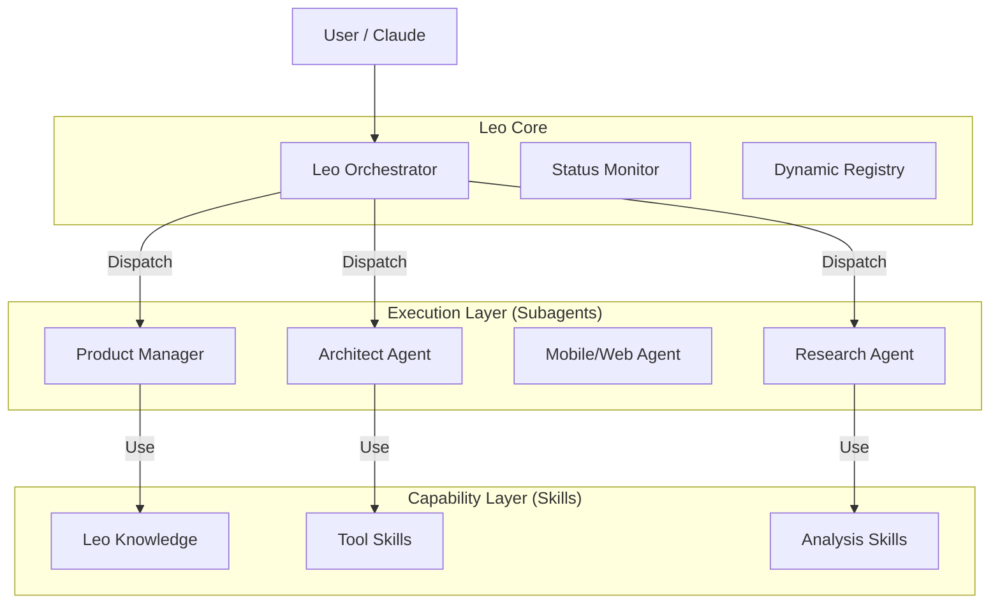
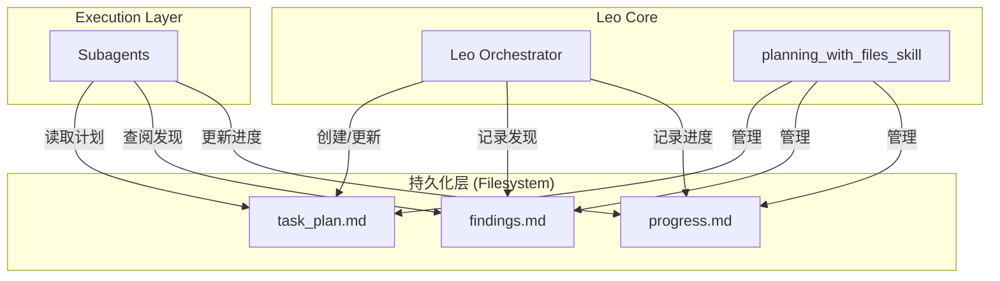

# System Architecture - Leo AI System

> **统一系统架构与记忆体系**
> 包含：三大系统关系 + 五层记忆架构 + 核心工作流程

---

## 1. 系统全景图

```
┌─────────────────────────────────────────────────────────────────────┐
│                        Leo AI System (你的核心大脑)                   │
│                                                                      │
│  ┌─────────────────────────────────────────────────────────────┐    │
│  │                     记忆体系 (Memory)                        │    │
│  │  ┌──────────────┐  ┌──────────────┐  ┌──────────────┐       │    │
│  │  │ 静态上下文    │  │ 动态索引     │  │ 动态状态     │       │    │
│  │  │ (长期记忆)    │  │ (能力清单)   │  │ (工作记忆)   │       │    │
│  │  ├──────────────┤  ├──────────────┤  ├──────────────┤       │    │
│  │  │ user_profile │  │capability_   │  │task_plan     │       │    │
│  │  │ dev_guide    │  │ index        │  │ findings     │       │    │
│  │  │ architecture │  │ skill_index  │  │ progress     │       │    │
│  │  └──────────────┘  └──────────────┘  └──────────────┘       │    │
│  └─────────────────────────────────────────────────────────────┘    │
│                                                                      │
│  ┌─────────────┐  ┌─────────────┐  ┌─────────────┐                  │
│  │   Skills    │  │  Subagents  │  │  Workflows  │                  │
│  │  (能力库)    │  │  (执行者)    │  │  (流水线)   │                  │
│  └─────────────┘  └─────────────┘  └─────────────┘                  │
└─────────────────────────────┬───────────────────────────────────────┘
                              │
                              ▼
┌─────────────────────────────────────────────────────────────────────┐
│                    OpenClaw (大龙虾系统)                             │
│  ┌─────────────────────────────────────────────────────────────┐    │
│  │  Gateway 控制平面                                            │    │
│  │  • 多渠道路由 (飞书/微信/Telegram等)                         │    │
│  │  • 定时任务                                                   │    │
│  │  • 技能管理                                                   │    │
│  └─────────────────────────────────────────────────────────────┘    │
│                                                                      │
│  部署状态:                                                           │
│  ✅ 本地 Windows: 稳定运行                                          │
│  ⚠️  腾讯云硅谷: 不稳定，计划迁移到 Vultr                            │
└─────────────────────────────┬───────────────────────────────────────┘
                              │
                              ▼
┌─────────────────────────────────────────────────────────────────────┐
│                         飞书 (Feishu)                                │
│  • 消息推送通道                                                      │
│  • 机器人: cli_a9f18849edbb9cb1 (本地)                              │
│  • 机器人: cli_a9f7c17a65b89cd2 (云端)                              │
└─────────────────────────────────────────────────────────────────────┘
```

---

## 2. 三大系统关系

| 系统 | 角色 | 职责 | 存储位置 |
|------|------|------|----------|
| **Leo AI System** | 核心大脑 | 技能、代理、工作流、决策 | 本地 `src/` 目录 |
| **OpenClaw (大龙虾)** | 消息网关 | 多渠道分发、飞书集成、云端执行 | 云端 Linux 服务器 |
| **飞书** | 交互界面 | 用户消息输入、AI响应输出 | 飞书平台 |

---

## 3. 记忆体系（5层架构）

```
Layer 5: 全局配置 (C:\Users\刘方林\.claude\settings.json)
    ↓
Layer 4: 项目配置 (.claude/settings.local.json)
    ↓
Layer 3: 静态上下文 (src/leo_knowledge/context/)
    ├── user_profile.md      ← 核心！你的业务、目标、价值观
    ├── development_guide.md ← 开发规范、命名规则
    ├── system_architecture.md ← 本文档
    └── project_structure.md ← 当前文件结构
    ↓
Layer 2: 动态索引 (src/leo_knowledge/context/)
    ├── capability_index.md  ← 所有Skills/Agents/Workflows清单
    └── docs/reference/skill_index.md ← 技能索引
    ↓
Layer 1: 动态状态 (项目根目录)
    ├── task_plan.md         ← 当前任务进度
    ├── findings.md          ← 研究发现
    └── progress.md          ← 会话日志
```

### 文件优先级（每次会话必读）

| 优先级 | 文件 | 说明 |
|--------|------|------|
| 🔴 最高 | `src/leo_knowledge/context/user_profile.md` | 核心！业务、目标、价值观 |
| 🟠 高 | `CLAUDE.md` | 项目级指令 |
| 🟡 中 | `src/leo_knowledge/context/development_guide.md` | 开发规范 |
| 🟢 参考 | `src/leo_knowledge/context/system_architecture.md` | 本文档 |

---

## 4. 核心工作流程

```
用户输入 (飞书/本地)
    ↓
OpenClaw Gateway (消息路由)
    ↓
Leo AI System (决策执行)
    ├── Skills (原子能力)
    ├── Subagents (任务执行)
    └── Workflows (流水线)
    ↓
OpenClaw (结果分发)
    ↓
飞书/其他渠道 (用户反馈)
```

---

## 5. 系统组件详解

### 5.1 Leo AI System 核心组件

| 组件 | 路径 | 职责 |
|------|------|------|
| **Leo Orchestrator** | `src/leo_orchestrator/` | 意图识别、任务拆解、调度 |
| **Skills** | `src/leo_skills/` | 原子能力库 (40+ 技能) |
| **Subagents** | `src/leo_subagents/` | 任务执行代理 (10+ 代理) |
| **Workflows** | `src/leo_workflows/` | 流水线定义 (5+ 工作流) |

### 5.2 OpenClaw (大龙虾) 配置

| 配置项 | 值 |
|--------|-----|
| **项目地址** | https://github.com/openclaw/openclaw |
| **核心架构** | Gateway + 多代理路由 + 技能系统 |
| **支持平台** | 飞书、WhatsApp、Telegram、Discord等12+ |
| **安装命令** | `npm install -g openclaw@latest` |
| **配置文件** | `~/.openclaw/openclaw.json` |

### 5.3 飞书机器人配置

| 环境 | App ID | 用途 |
|------|--------|------|
| 本地 | `cli_a9f18849edbb9cb1` | 开发测试 |
| 云端 | `cli_a9f7c17a65b89cd2` | 生产环境 |

---

## 0. 核心方法论：上下文工程 (Context Engineering)

> **"Context Window = RAM（易失、有限），Filesystem = Disk（持久、无限）"**

Leo AI System 采用 **Manus 风格的上下文工程方法**，通过持久化文件系统解决 AI 代理的上下文丢失、目标漂移问题。

### 核心技能：planning_with_files_skill

| 文件 | 用途 | 更新时机 |
|------|------|----------|
| `task_plan.md` | 阶段、进度、决策 | 每个阶段完成后 |
| `findings.md` | 研究、发现 | 任何发现后（2-动作规则） |
| `progress.md` | 会话日志、测试结果 | 整个会话期间 |

### 关键规则
1. **先创建计划** - 复杂任务必须先有 task_plan.md
2. **2-动作规则** - 每2次搜索/浏览后保存发现
3. **决策前阅读** - 重大决策前重读计划
4. **记录所有错误** - 建立知识防止重复
5. **永不重复失败** - 跟踪尝试，改变方法

---

## 1. High-Level Architecture
采用 **Orchestrator-Worker** 模式，由统一的大脑指挥专业分工的执行者。



## 2. 核心组件 (Components)

### A. Orchestrator (编排器)
- **职责**: 意图识别、任务拆解、Agent 调度、工作流管理。
- **文件**: `leo_orchestrator/`

### B. Subagents (执行者)
- **职责**: 专精某一领域的任务执行。
- **列表**:
    - `Architect`: 技术决策
    - `Product Manager`: 需求定义
    - `Research`: 信息获取
    - `Task`: 通用执行
- **特点**: "Lazy Loading" 自身需要的 Knowledge。

### C. Skills (能力库)
- **职责**: 原子能力的具体实现 (Functions)。
- **特点**: 独立部署，通过 `cskill` 标准接口调用。

### D. Leo Knowledge (知识库)
- **职责**: 存储静态上下文 (Frameworks, Templates, Indices)。
- **路径**: `leo_knowledge/`

### E. Context Engineering (上下文工程) 🆕
- **职责**: 持久化任务状态、发现和进度，解决上下文丢失问题。
- **核心技能**: `planning_with_files_skill`
- **文件**: `task_plan.md`, `findings.md`, `progress.md`
- **特点**: 让整个系统具备"外部记忆"，支持跨会话连续性。

## 3. 上下文工程集成架构



## 4. 外部集成架构

```
┌─────────────────────────────────────────────────────────────┐
│                      用户交互层                              │
│  ┌──────────┐  ┌──────────┐  ┌──────────┐                  │
│  │  飞书    │  │  微信    │  │ Claude   │                  │
│  │(OpenClaw)│  │ (Future) │  │  Code    │                  │
│  └────┬─────┘  └────┬─────┘  └────┬─────┘                  │
│       └─────────────┴──────┬──────┘                         │
│                            │                                 │
│  ┌─────────────────────────▼─────────────────────────────┐  │
│  │              OpenClaw Gateway (编排层)                 │  │
│  │  • 多渠道路由  • 定时任务  • 技能管理                   │  │
│  └─────────────────────────┬─────────────────────────────┘  │
│                            │                                 │
│  ┌─────────────────────────▼─────────────────────────────┐  │
│  │              Leo AI System (能力层)                    │  │
│  │  Skills + Agents + Workflows + Context Engineering    │  │
│  └───────────────────────────────────────────────────────┘  │
└─────────────────────────────────────────────────────────────┘
```

## 5. 三阶段项目执行工作流 🆕

> 基于 ai_coding_project_base 的系统化项目执行方法论

### 概述

三阶段工作流为复杂项目提供结构化的执行框架，确保每个阶段的完整性验证。

```
┌─────────────────────────────────────────────────────────────────┐
│                    三阶段项目执行流程                             │
├─────────────────────────────────────────────────────────────────┤
│                                                                 │
│   ┌─────────────┐    ┌─────────────┐    ┌─────────────┐        │
│   │   准备      │ →  │   执行      │ →  │   检查      │        │
│   │ /phase-prep │    │ /phase-start│    │/phase-checkpoint│    │
│   └─────────────┘    └─────────────┘    └─────────────┘        │
│        ↓                  ↓                  ↓                  │
│   先决条件检查        任务逐个执行         验证与安全扫描         │
│                                                                 │
└─────────────────────────────────────────────────────────────────┘
```

### 核心技能组

| 阶段 | 技能 | 职责 |
|------|------|------|
| **准备** | `phase_prep_skill` | 检查先决条件、预览人工审核项 |
| **执行** | `phase_start_skill` | 自主执行阶段中所有任务 |
| **检查** | `phase_checkpoint_skill` | 运行测试、安全扫描、验证完成 |

### 辅助技能

| 技能 | 用途 |
|------|------|
| `fresh_start_skill` | 项目上下文加载 |
| `populate_state_skill` | 状态初始化 |
| `progress_skill` | 进度查看 |

### 验证技能

| 技能 | 用途 |
|------|------|
| `code_verification_skill` | 代码验收标准验证 |
| `auto_verify_skill` | 自动化验证 |
| `browser_verification_skill` | 浏览器验证 |
| `verify_task_skill` | 单任务验证 |
| `spec_verification_skill` | 规格验证 |
| `criteria_audit_skill` | 验收标准审计 |

### 工作流程详情

#### Phase 1: 准备 (/phase-prep)

1. **上下文加载** - 使用 `fresh_start_skill` 加载项目状态
2. **先决条件检查** - 验证环境、依赖、配置
3. **预览人工项** - 列出需要人工审核的检查点

#### Phase 2: 执行 (/phase-start)

1. **Git 工作流** - 每个阶段一个分支，每个任务一次提交
2. **任务执行** - 按计划逐个执行任务
3. **即时验证** - 每个任务完成后立即验证
4. **状态跟踪** - 实时更新进度

#### Phase 3: 检查 (/phase-checkpoint)

1. **测试运行** - 执行单元测试、集成测试
2. **安全扫描** - 运行安全检查
3. **文档同步** - 验证文档更新
4. **人工审核** - 预览需要人工确认的项

### 文档结构

项目执行期间自动维护以下文档：

| 文档 | 用途 |
|------|------|
| `AGENTS.md` | 工作流规范和约定 |
| `EXECUTION_PLAN.md` | 任务列表和验收标准 |
| `PRODUCT_SPEC.md` | 产品规格说明 |
| `TECHNICAL_SPEC.md` | 技术规格说明 |
| `LEARNINGS.md` | 发现的模式和注意事项 |

---

## 6. 最佳实践标准 (Best Practice Standards)

> **⚠️ 强制执行**: 所有 Skills、Agents、Workflows 必须符合以下最佳实践标准

### 6.1 标准技能结构 (`{skill_name}_skill/`)

```
{skill_name}_skill/
├── SKILL.md              ✅ 必需 - 技能定义（含YAML frontmatter）
├── README.md             ✅ 推荐 - 使用说明
├── {skill_name}_skill.py ✅ 推荐 - 主类实现（继承EvolvableSkill）
├── config/
│   └── config.yaml       ✅ 推荐 - 配置文件
├── scripts/
│   └── main.py           ⬜ 可选 - 入口脚本
├── evolution.json        ✅ 进阶 - 进化记录
└── __init__.py           ✅ 推荐 - 包初始化
```

### 6.2 标准代理结构 (`{domain}_agent/`)

```
{domain}_agent/
├── AGENT.md              ✅ 必需 - 代理定义
├── {domain}_agent.py     ✅ 必需 - 主类实现（继承BaseAgent）
├── __init__.py           ✅ 推荐 - 包初始化
└── evolution.json        ✅ 进阶 - 进化记录
```

### 6.3 标准工作流结构 (`{pipeline_name}_pipeline/`)

```
{pipeline_name}_pipeline/
├── workflow.yaml         ✅ 必需 - 工作流定义
├── {pipeline_name}_pipeline.py  ✅ 必需 - 工作流引擎
├── README.md             ✅ 推荐 - 说明文档
└── __init__.py           ✅ 推荐 - 包初始化
```

### 6.4 SKILL.md 必须包含的YAML Frontmatter

```yaml
---
name: {skill_name}
version: "1.0.0"
description: |
  技能简短描述（用于技能发现）
category: {category}
author: Leo AI System
user-invocable: true
priority: 1
activation_keywords:
  - keyword1
  - keyword2
allowed-tools:
  - Read
  - Write
  - Bash
---
```

### 6.5 AGENT.md 必须包含的内容

```markdown
# {Agent Name}

## 代理描述
一句话说明代理的职责

## 能力范围
- 能力1
- 能力2

## 使用示例
```示例代码
```

## 依赖的Skills
- skill1
- skill2
```

### 6.6 evolution.json 标准格式

```json
{
  "version": "1.0.0",
  "evolution_history": [
    {
      "version": "1.0.0",
      "date": "2026-02-01",
      "changes": "Initial creation"
    }
  ],
  "learned_tips": [],
  "learned_errors": []
}
```

### 6.7 config/config.yaml 标准格式

```yaml
skill:
  name: {skill_name}
  version: 1.0.0
  category: {category}

execution:
  timeout: 300
  retry: 3

evolution:
  enabled: true
  learn_on_failure: true
  max_tips: 100
```

### 6.8 命名规范（强制）

| 类型 | 格式 | 示例 |
|-----|------|------|
| 技能目录 | `{功能}_{类型}_skill` | `github_to_skills_skill` |
| 代理目录 | `{领域}_agent` | `research_agent` |
| 工作流目录 | `{业务}_pipeline` | `content_pipeline` |
| Python类 | `PascalCase` | `ResearchAgent` |
| Python函数/变量 | `snake_case` | `execute_task` |
| 配置文件 | `snake_case.yaml` | `config.yaml` |

**禁止使用**:
- 连字符 `-` (hyphen)
- 空格
- 大写字母（目录/文件名）

### 6.9 技能质量检查清单

每个技能必须通过以下检查：

- [ ] SKILL.md 包含完整的YAML frontmatter
- [ ] description 简洁明了，适合技能发现
- [ ] category 使用 snake_case
- [ ] activation_keywords 包含相关关键词
- [ ] 主类继承正确的基类（EvolvableSkill）
- [ ] `execute()` 方法有清晰的参数和返回值
- [ ] `__init__.py` 正确导出主类
- [ ] config/config.yaml 包含必要配置
- [ ] evolution.json 存在且格式正确
- [ ] 命名符合 snake_case 规范

### 6.10 最佳实践验证命令

```bash
# 验证所有技能结构
python scripts/validate_skills.py

# 验证命名规范
python scripts/validate_naming.py

# 生成缺失的骨架文件
python scripts/scaffold_skills.py
```

---

## 7. 文件修改规则

### 7.1 确认用户意图规则（强制）

**在执行任何重大改动前，必须先确认用户意图。**

重大改动包括：
- 目录/文件重命名
- 架构调整
- 批量修改
- 删除操作
- 配置变更

**执行流程**：
1. 分析改动影响范围
2. 列出所有受影响的文件/配置
3. 明确说明改动内容
4. **等待用户确认后再执行**

```markdown
❌ 错误：直接执行改动
✅ 正确：先确认 → 用户同意 → 再执行
```

### 7.2 代码质量规则

- 复杂逻辑必须包含**中文注释**
- 使用 Type Hints
- 遵循 PEP 8 规范
- 避免硬编码路径（使用路径常量）

---

## 7. 去重与规范化机制 (Deduplication & Standardization)

> **强制执行**: 所有 Skills、Agents、Workflows 必须符合以下去重和命名规范

### 7.1 命名规范（强制）

| 类型 | 格式 | 示例 |
|-----|------|------|
| 技能目录 | `{功能}_{类型}_skill` | `web_search_skill` |
| 代理目录 | `{领域}_agent` | `research_agent` |
| 工作流目录 | `{业务}_pipeline` | `content_pipeline` |
| Python类 | `PascalCase` | `ResearchAgent` |
| Python函数/变量 | `snake_case` | `execute_task` |
| 配置文件 | `snake_case.yaml` | `config.yaml` |

**禁止使用**:
- `-` 连字符（hyphen）
- 空格
- 大写字母开头的目录/文件名
- 中文目录名

### 7.2 强制去重机制

#### 7.2.1 去重检查清单

新增任何 Skills/Agents/Workflows 前，必须检查：

| 检查项 | 说明 |
|-------|------|
| **功能重复检查** | 搜索 skill_index 和 capability_index，确认无相似功能 |
| **命名冲突检查** | 确认目录名/文件名唯一 |
| **能力重叠检查** | 评估与现有技能的能力边界 |

#### 7.2.2 重复处理策略

| 场景 | 处理方式 |
|------|----------|
| 功能完全相同 | 合并为一个技能，保留最优实现 |
| 功能部分重叠 | 合并为一个技能，整合能力 |
| 功能相似但不同 | 保留各自，明确区分使用场景 |
| 命名冲突 | 使用更精确的命名区分 |

#### 7.2.3 去重验证命令

```bash
# 验证命名规范
python scripts/validate_naming.py

# 验证技能结构
python scripts/validate_skills.py

# 检查重复技能
python scripts/check_duplicates.py
```

### 7.3 目录规范化状态

| 状态 | 类别 | 原名称 | 新名称 |
|------|------|--------|--------|
| ✅ 已完成 | videocut_skills | `剪口播` | `cut_speech_skill` |
| ✅ 已完成 | videocut_skills | `剪辑` | `video_editing_skill` |
| ✅ 已完成 | videocut_skills | `字幕` | `subtitle_skill` |
| ✅ 已完成 | videocut_skills | `安装` | `install_skill` |
| ✅ 已完成 | videocut_skills | `自更新` | `auto_update_skill` |

### 7.4 目录结构标准

```
src/
├── leo_skills/                    # 所有技能
│   ├── {category}/               # 类别目录 (snake_case)
│   │   ├── {skill_name}_skill/  # 技能目录
│   │   └── ...
│   └── ...
├── leo_subagents/                # 所有代理
│   └── {domain}_agent/           # 代理目录
├── leo_workflows/                # 所有工作流
│   └── {business}_pipeline/      # 工作流目录
└── leo_knowledge/                # 知识库
    └── context/                  # 上下文文件
```

---

## 8. 持续演进

### 最佳实践更新日志

| 日期 | 版本 | 更新内容 |
|------|------|----------|
| 2026-02-01 | 1.0.0 | 初始最佳实践标准定义 |
| 2026-02-01 | 1.1.0 | 新增去重与规范化机制 |

### 参考资源

- [obra/superpowers](https://github.com/obra/superpowers) - 社区最佳实践参考
- [anthropics/skills](https://github.com/anthropics/skills) - 官方技能标准
- [ai_coding_project_base](docs/reference/ai_coding_project_base/) - 项目执行最佳实践
