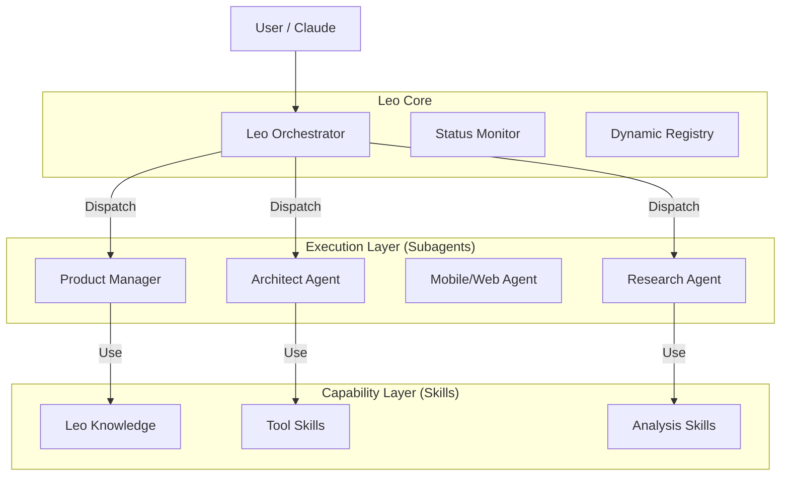

# System Architecture - Leo AI System

## 1. High-Level Architecture
采用 **Orchestrator-Worker** 模式，由统一的大脑指挥专业分工的执行者。

## 2. 核心组件 (Components)

### A. Orchestrator (编排器)
- **职责**: 意图识别、任务拆解、Agent 调度、工作流管理。
- **文件**: `leo_orchestrator/`

### B. Subagents (执行者)
- **职责**: 专精某一领域的任务执行。
- **列表**:
    - `Architect`: 技术决策
    - `Product Manager`: 需求定义
    - `Research`: 信息获取
    - `Task`: 通用执行
- **特点**: "Lazy Loading" 自身需要的 Knowledge。

### C. Skills (能力库)
- **职责**: 原子能力的具体实现 (Functions)。
- **特点**: 独立部署，通过 `cskill` 标准接口调用。

### D. Leo Knowledge (知识库)
- **职责**: 存储静态上下文 (Frameworks, Templates, Indices)。
- **路径**: `leo_knowledge/`
