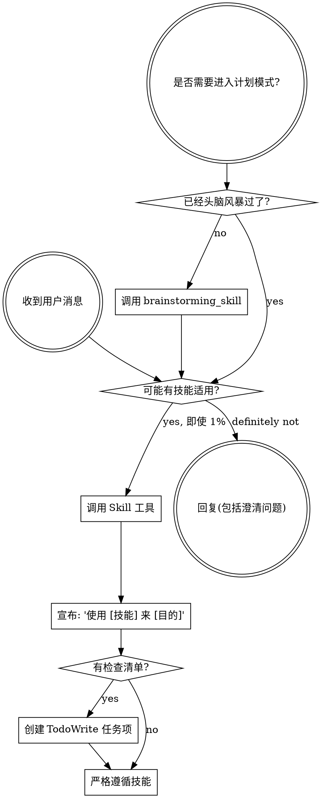

# 技能发现与自动调用（Using Superpowers）

## 概述

建立如何发现和使用技能的基础规则。这是所有其他技能的入口。

**核心规则**：即使只有 1% 的可能性某个技能适用，也**必须**调用它。

## 技能调用流程

## 规则

**在任何响应或操作之前调用相关技能。** 即使只有 1% 的可能性，也应调用技能检查。
如果调用后发现技能不适合当前情况，可以不使用它。

## 红旗

这些想法意味着停止——你在合理化：

| 想法 | 现实 |
|------|------|
| "这只是一个简单问题" | 问题也是任务。检查技能。 |
| "我需要先了解更多上下文" | 技能检查在澄清问题之前。 |
| "让我先探索代码库" | 技能告诉你如何探索。先检查。 |
| "这不需要正式技能" | 如果技能存在，就使用它。 |
| "我记得这个技能" | 技能会演进。读取当前版本。 |
| "技能太重了" | 简单的事情会变复杂。使用它。 |
| "让我先做这一件事" | 做任何事之前先检查。 |

## 技能优先级

当多个技能可能适用时，使用此顺序：

1. **流程技能优先**（brainstorming、debugging）- 决定如何处理任务
2. **实施技能其次**（frontend-design、mcp-builder）- 指导执行

## 技能类型

**刚性**（TDD、debugging）：严格遵循。不要偏离纪律。

**灵活**（patterns）：根据上下文调整原则。

技能本身会告诉你它是哪种类型。

## 用户指令

指令说明**做什么**，而不是**怎么做**。"添加 X" 或 "修复 Y" 不意味着跳过工作流。

## 致谢

基于 [obra/superpowers](https://github.com/obra/superpowers) v4.3.1